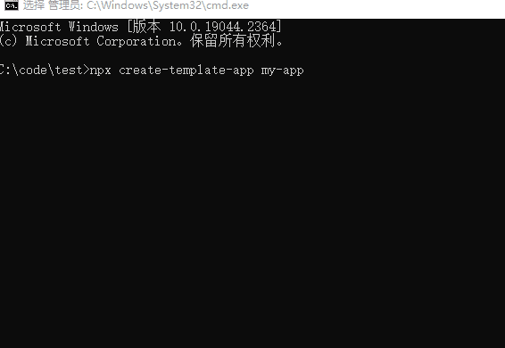

# create-template-app  

`create-template-app` 可用于快速生成开发项目模板



# 安装和使用

```shell
npx create-template-app my-app
```

# 参考

[create-react-app](https://github.com/facebook/create-react-app)

> Set up a modern web app by running one command.
